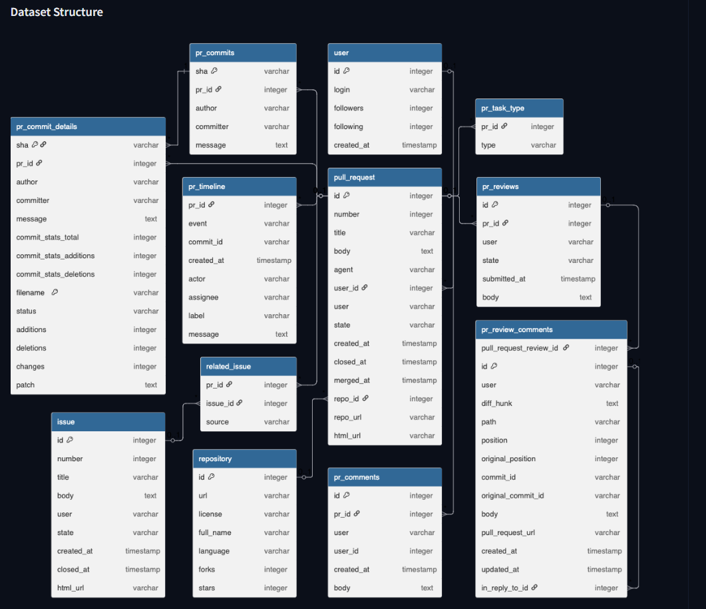
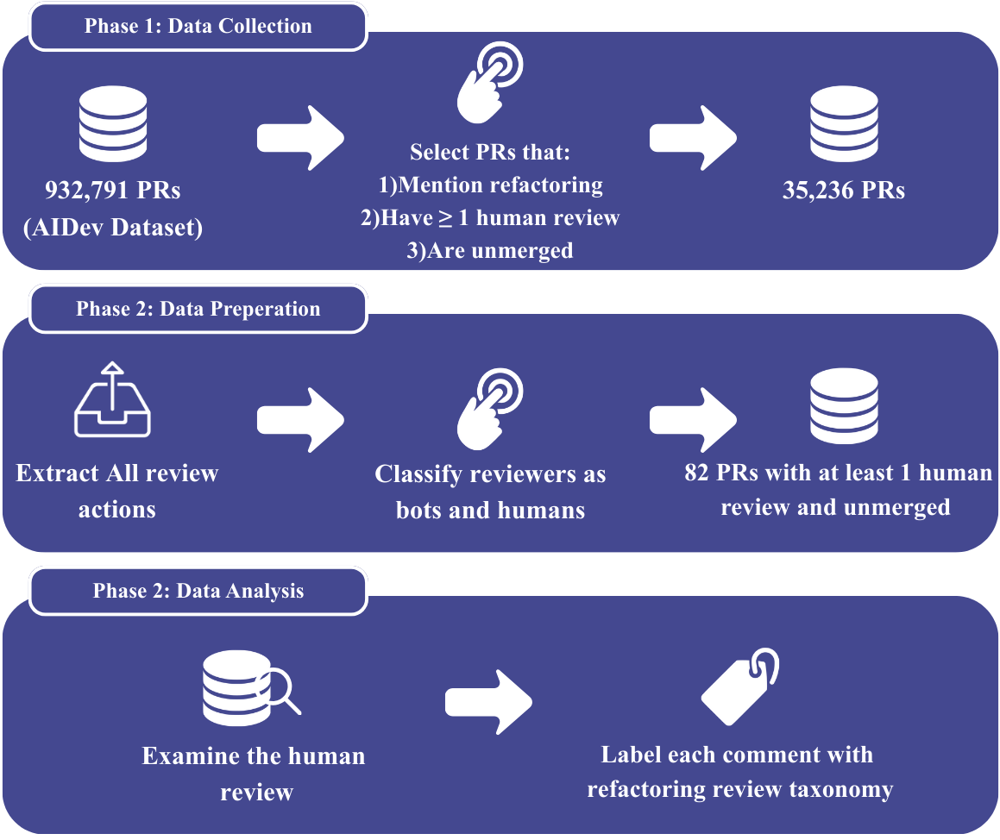

# AI-Generated Refactoring Pull Requests — Replication Package

This repository provides the replication package for our study on **AI-generated refactoring pull requests** in the AIDev dataset.

The study investigates:
- how autonomous coding agents describe refactoring changes,
- what refactoring transformation patterns they produce,
- how human reviewers evaluate these pull requests,
- and why many AI-generated refactorings are not integrated.

---

## Research Questions

### RQ1 — Refactoring Patterns
Analyzes refactoring action verbs and transformation patterns used by AI agents and classifies pull requests into:
- Internal quality attributes  
- External quality attributes  
- Code smells  

Implementation: `src/rq1/`

---

### RQ2 — Review Analysis
Examines how human reviewers respond to AI-generated refactoring PRs using the Refactoring Review Taxonomy.

Implementation: `src/rq2/`

---

## Repository Structure

```
src/
  rq1/        # Refactoring pattern mining (RQ1)
  rq2/        # Review analysis (RQ2)

study_design/
  rq1/        # Dataset + data extraction notes for RQ1
  rq2/        # Dataset + data extraction notes for RQ2

experiments/
  rq1/        # Tables/Figures for RQ1
  rq2/        # Tables/Figures for RQ2

discussion/
  rq1/        # Discussion & takeaways for RQ1
  rq2/        # Discussion & takeaways for RQ2
```

## Dataset

We use the **AIDev** dataset of AI-generated pull requests.

(https://github.com/SAILResearch/AI_Teammates_in_SE3)

---

## Study Design
### RQ1 Study Pipeline

µ

This figure summarizes the data collection, preparation, and analysis workflow used for RQ2.


### RQ2 Study Pipeline



This figure summarizes the data collection, preparation, and analysis workflow used for RQ2.

---

## Reproducibility

See:
- `REPRODUCIBILITY.md` — pipeline overview  
- `src/rq1/` — RQ1 implementation  
- `src/rq2/` — RQ2 implementation  

---

## Requirements

- Python 3.10+
- pandas
- numpy
- regex
- matplotlib
- tqdm

---

## License

MIT License
